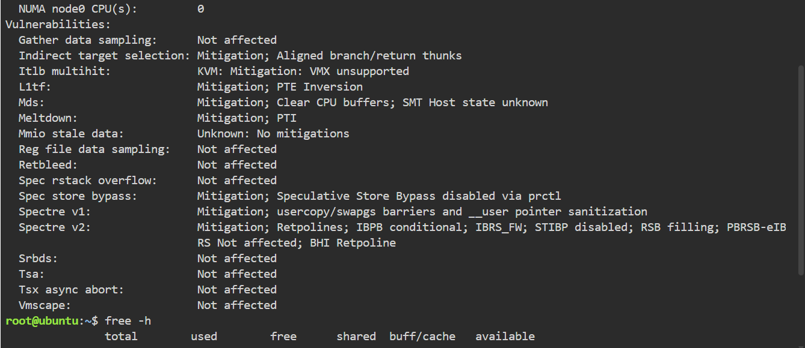
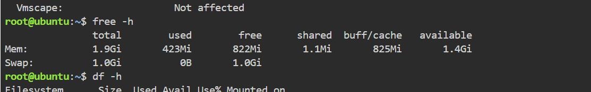
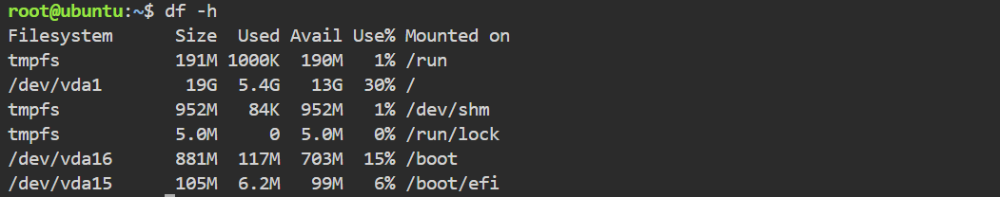

# Laboratory 03 – Multi-Cloud Explorer

## Mission 3: Become a Multi-Cloud Explorer

This laboratory activity focuses on understanding and evaluating three leading cloud computing platforms: Amazon Web Services (AWS), Microsoft Azure, and Google Cloud Platform (GCP).

Throughout this mission, I will investigate the services and capabilities of each cloud provider, compare their features, and determine which platforms are suitable for different business requirements and scenarios.

## Cloud Providers

- Amazon Web Services (AWS)
- Microsoft Azure
- Google Cloud Platform (GCP)

## Mission Activities

1. Expand the Cloud Computing Portfolio
2. Explore AWS, Microsoft Azure, and Google Cloud Platform
3. Compare the Major Cloud Platforms
4. Analyze Client Requirements and Recommend Cloud Solutions
5. Match Equivalent Cloud Services
6. Create a Multi-Cloud Decision Matrix
7. Continue the Linux System Investigation
8. Write the Mission Reflection

## Objective

The main objective of this laboratory is to develop a better understanding of multi-cloud computing and practice selecting appropriate cloud solutions based on technical and business requirements.


## Checkpoint 7 – Continue Your Linux Investigation

The Linux environment used for this investigation was Ubuntu 24.04.4 LTS. The following system information was collected from the KillerCoda terminal.

### Linux System Information

- **Operating System:** Ubuntu 24.04.4 LTS
- **CPU:** Intel Xeon E312xx (Sandy Bridge), x86_64
- **Memory:** 1.9 GiB
- **Disk Space:** 19 GB total, with approximately 13 GB available

### Commands Used

```bash
cat /etc/os-release
lscpu
free -h
df -h

```

### Terminal Evidence

The screenshots below show the Linux commands and system information collected from the KillerCoda terminal.

#### Operating System


#### CPU Information




#### Memory



#### Disk Space


